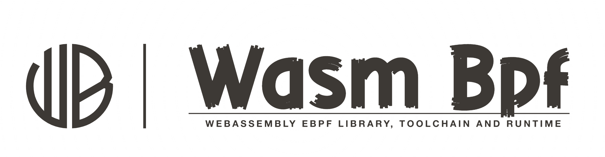

# 📦 Wasm-bpf: Wasm library and toolchain for eBPF

[](https://github.com/eunomia-bpf/wasm-bpf/actions)
[](https://www.codefactor.io/repository/github/eunomia-bpf/wasm-bpf)
[](https://deepsource.io/gh/eunomia-bpf/wasm-bpf/?ref=repository-badge)

[中文文档](README_zh.md)

`Wasm-bpf` is a WebAssembly eBPF library, toolchain and runtime powered by [CO-RE](https://facebookmicrosites.github.io/bpf/blog/2020/02/19/bpf-portability-and-co-re.html)(Compile Once – Run Everywhere) [libbpf](https://github.com/libbpf/libbpf) and [WAMR](https://github.com/bytecodealliance/wasm-micro-runtime). It can help you build almost every eBPF programs or usecases to `Wasm`.

## Features

- **`General purpose`**: provide most abilities from eBPF to Wasm, `polling` from the ring buffer or perf buffer, bidirectional communications between `kernel` eBPF and `userspace` Wasm using `maps`, dynamically `loading`, `attaching` or `detaching`, etc. Supports a large number of eBPF program types and map types.
- **`High performance`**: No `serialization` overhead for complex data types, using `shared memory` to avoid copy overhead between host and Wasm.
- **`Easy to use`**: provide a similar developing experience as the [libbpf-bootstrap](https://github.com/libbpf/libbpf-bootstrap), `auto generate` the Wasm-eBPF skeleton headers and type definitions for bindings. Write your eBPF programs in `C/C++`, `Rust`, `Go` and compile to Wasm.
- **`Ultralightweight`**: the sample runtime has only `1.5 MB` in binary size. Compiled Wasm module would be only `~90K`. With the same toolchain, you can easily build your own Wasm-eBPF runtime in any languages and platforms!

See the [examples](examples) directory for examples of eBPF programs written in C, Rust, Go and compiled to Wasm, covering the use cases from `tracing`, `networking` to `security`.

For tools to distribute Wasm-eBPF programs in [`OCI`](https://opencontainers.org/) images, please refer to [eunomia-bpf](https://github.com/eunomia-bpf/eunomia-bpf) repo.

## How it works

The wasm-bpf runtime require two parts: `the host side`(Outside the Wasm runtime) and the `Wasm guest side`(Inside the Wasm runtime).

- host side: A simple runtime implementation example
  - see [src](runtime/cpp/src) and [include](runtime/cpp/include) directories, which would be a sample runtime built on the top of [libbpf](https://github.com/libbpf/libbpf) and [WAMR](https://github.com/bytecodealliance/wasm-micro-runtime).
  - You can easily build your own Wasm-eBPF runtime in `any` languages, `any` eBPF libraries and `any` Wasm runtimes with the same System interface.
- wasm side: toolchains and libraries
  - a [`libbpf-wasm`](wasm-sdk/c/libbpf-wasm.h) header only library to provide libbpf APIs for Wasm guest `C/C++` code.
  - a [`bpftool`](https://github.com/eunomia-bpf/bpftool/tree/wasm-bpftool) tool to generate the Wasm-eBPF `skeleton` headers, and `C struct definitions` for passing data between the host and Wasm guest without serialization.
  - More languages support(`Rust`, `Go`, etc) is on the way.

For details compile process, please refer to the [examples/bootstrap/README.md](examples/bootstrap/README.md).  The figure below shows the overall interaction between the eBPF and Wasm runtimes:


A Wasm module could load and control multiple eBPF programs at the same time, and can call another Wasm module written in other languages to process the data or control with [the component model](https://github.com/WebAssembly/component-model).

We have proposed a new WASI issue [wasi-bpf](https://github.com/WebAssembly/WASI/issues/513).

## 🔨 Examples

See the [examples](examples) directory for examples of eBPF programs written in C, Rust, Go and compiled to WASM.

- [bootstrap](examples/bootstrap) and [rust-bootstrap](examples/rust-bootstrap) `tracing examples`
- [runqlat](examples/runqlat) `tracing examples`
- [go-execve](examples/go-execve) `tracing examples`
- [lsm](examples/lsm) and  `security example`
- [sockfilter](examples/sockfilter) `networking example`
- [sockops](examples/sockops) `networking example`

## build the runtime

The dependencies are libbpf and wasm-micro-runtime only, they are
registered as git submodules.

```sh
git submodule update --init --recursive
```

### Install Dependencies

You will need `clang`, `libelf` and `zlib` to build the examples,
package names may vary across distros.

On Ubuntu/Debian, you need:

```shell
apt install clang libelf1 libelf-dev zlib1g-dev
```

On CentOS/Fedora, you need:

```shell
dnf install clang elfutils-libelf elfutils-libelf-devel zlib-devel
```

### Build runtime as a executable tool

Run `make` to build the runtime, which will be placed in the `build`
directory. `cmake` is required to build the runtime.

```sh
make build
```

### Build runtime as a library

```sh
make build-lib
```

You may refer to [CI](.github/workflows/c-cpp.yml) for more details on how
to build and run the examples.

## LICENSE

MIT

## 🔗 Links

- eunomia-bpf project: simplify and enhance eBPF with CO-RE and WebAssembly https://github.com/eunomia-bpf/eunomia-bpf
- documents and blogs: https://eunomia-bpf.github.io/blog/ebpf-wasm.html
- CO-RE (Compile Once – Run Everywhere): https://facebookmicrosites.github.io/bpf/blog/2020/02/19/bpf-portability-and-co-re.html
- WAMR (WebAssembly Micro Runtime): https://github.com/bytecodealliance/wasm-micro-runtime
- libbpf: https://github.com/libbpf/libbpf
