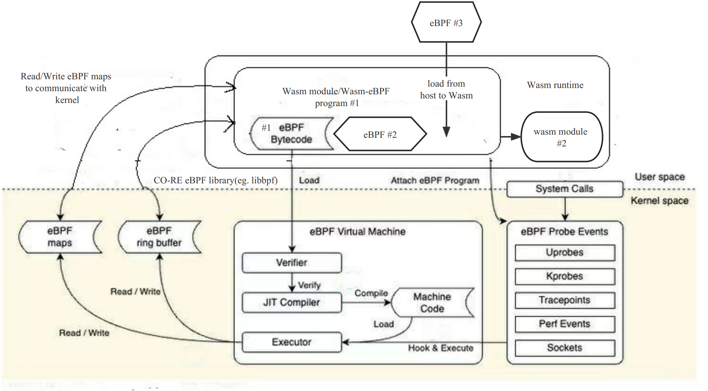

# wasm-bpf: Wasm runtime for eBPF

[](https://github.com/eunomia-bpf/wasm-bpf/actions)
[](https://www.codefactor.io/repository/github/eunomia-bpf/eunomia-bpf)

A WebAssembly eBPF library and runtime powered by [CO-RE](https://facebookmicrosites.github.io/bpf/blog/2020/02/19/bpf-portability-and-co-re.html)(Compile Once – Run Everywhere) [libbpf](https://github.com/libbpf/libbpf) and [WAMR](https://github.com/bytecodealliance/wasm-micro-runtime).

- `General purpose`: provide most abilities from eBPF to Wasm, `polling` from the ring buffer or perf buffer, communications between `kernel` eBPF and `userspace` Wasm using `maps`, dynamically `loading`, `attaching` or `detaching`, etc. Supports a large number of eBPF program types and map types, covering the use cases from `tracing`, `networking`, `security`.
- `high performance`: No `serialization` overhead for comlex data types, use `shared memory` to avoid copy overhead between host and Wasm.
- `Easy to use`: provide a similar developing experience as the [libbpf-bootstrap](https://github.com/libbpf/libbpf-bootstrap), `auto generate` the Wasm-eBPF `skeleton` headers and compile to Wasm.
- `Ultralightweight`: the runtime has only `300+` lines of code, only `1.5 MB` in size. Compiled Wasm module would be only `~90K`.

## How it works

The wasm-bpf runtime require two parts: `the host side`(Outside the Wasm runtime) and the `Wasm guest side`(Inside the Wasm runtime).

- host side: see [src](src) and [include](include) directories, which would be a runtime built on the top of [libbpf](https://github.com/libbpf/libbpf) and [WAMR](https://github.com/bytecodealliance/wasm-micro-runtime).
- wasm side:
  - a [`libbpf-wasm`](wasm-include/libbpf-wasm.h) header only library to provide libbpf APIs for Wasm guest `C/C++` code.
  - a [`bpftool`](https://github.com/eunomia-bpf/bpftool/tree/wasm-bpftool) tool to generate the Wasm-eBPF `skeleton` headers, and `C struct definitions` for passing data between the host and Wasm guest without serialization.
  - More languages support(`Rust`, `Go`, etc) is on the way.

For details compile process, please refer to the [examples/bootstrap/README.md](examples/bootstrap/README.md).

## examples

See the [examples](examples) directory for examples of eBPF programs written in C and compiled to WASM.

### C example: Bootstrap

`bootstrap` is an example of a simple (but realistic) BPF application. It
tracks process starts (`exec()` family of syscalls, to be precise) and exits
and emits data about filename, PID and parent PID, as well as exit status and
duration of the process life. With `-d <min-duration-ms>` you can specify
minimum duration of the process to log. In such mode process start
(technically, `exec()`) events are not output (see example output below).

`bootstrap` was created in the similar spirit as
[libbpf-tools](https://github.com/iovisor/bcc/tree/master/libbpf-tools) from
BCC package, but is designed to be more stand-alone and with simpler Makefile
to simplify adoption to user's particular needs. It demonstrates the use of
typical BPF features:

- cooperating BPF programs (tracepoint handlers for process `exec` and `exit`
    events, in this particular case);
- BPF map for maintaining the state;
- BPF ring buffer for sending data to user-space;
- global variables for application behavior parameterization.
- it utilizes BPF CO-RE and vmlinux.h to read extra process information from
    kernel's `struct task_struct`.

Here's an example output:

```console
$ sudo sudo ./wasm-bpf bootstrap.wasm -h
BPF bootstrap demo application.

It traces process start and exits and shows associated 
information (filename, process duration, PID and PPID, etc).

USAGE: ./bootstrap [-d <min-duration-ms>] -v
$ sudo ./wasm-bpf bootstrap.wasm
TIME     EVENT COMM             PID     PPID    FILENAME/EXIT CODE
18:57:58 EXEC  sed              74911   74910   /usr/bin/sed
18:57:58 EXIT  sed              74911   74910   [0] (2ms)
18:57:58 EXIT  cat              74912   74910   [0] (0ms)
18:57:58 EXEC  cat              74913   74910   /usr/bin/cat
18:57:59 EXIT  cat              74913   74910   [0] (0ms)
18:57:59 EXEC  cat              74914   74910   /usr/bin/cat
18:57:59 EXIT  cat              74914   74910   [0] (0ms)
18:57:59 EXEC  cat              74915   74910   /usr/bin/cat
18:57:59 EXIT  cat              74915   74910   [0] (1ms)
18:57:59 EXEC  sleep            74916   74910   /usr/bin/sleep
```

The original c code is from [libbpf-bootstrap](https://github.com/libbpf/libbpf-bootstrap).

### C example: runqlat

This program summarizes scheduler run queue latency as a histogram, showing
how long tasks spent waiting their turn to run on-CPU.

This program summarizes scheduler run queue latency as a histogram, showing
how long tasks spent waiting their turn to run on-CPU.

```console
$ sudo ./wasm-bpf runqlat.wasm -h
Summarize run queue (scheduler) latency as a histogram.

USAGE: runqlat [--help] [interval] [count]

EXAMPLES:
    runqlat         # summarize run queue latency as a histogram
    runqlat 1 10    # print 1 second summaries, 10 times
$ sudo ./wasm-bpf runqlat.wasm 1

Tracing run queue latency... Hit Ctrl-C to end.

     usecs               : count    distribution
         0 -> 1          : 72       |*****************************           |
         2 -> 3          : 93       |*************************************   |
         4 -> 7          : 98       |****************************************|
         8 -> 15         : 96       |*************************************** |
        16 -> 31         : 38       |***************                         |
        32 -> 63         : 4        |*                                       |
        64 -> 127        : 5        |**                                      |
       128 -> 255        : 6        |**                                      |
       256 -> 511        : 0        |                                        |
       512 -> 1023       : 0        |                                        |
      1024 -> 2047       : 0        |                                        |
      2048 -> 4095       : 1        |                                        |
```

`runqlat` is alse an example of a simple (but realistic) BPF application. It
would show a more complex example of BPF program, which contains more than
one file, and directly access the kernel maps from the user space instead of
polling the kernel ring buffer.

The runtime would use shared memory to access the kernel maps, and the kernel
would update the maps in the shared memory, so the wasm code can access the
eBPF maps directly, without any serialization or copy overhead between userspace
host and Wasm runtime.

You can use the `bpf_map_update_elem` API to update the kernel maps from the user
space, for example:

```c
        cg_map_fd = bpf_map__fd(obj->maps.cgroup_map);
        ....
        bpf_map_update_elem(cg_map_fd, &idx, &cgfd, BPF_ANY);
```

So the kernel eBPF can be config by wasm side or recieve the messages from
userspace wasm runtime when it is running.

## build the runtime

The dependencies are libbpf and wasm-micro-runtime only, they are
registered as git submodules.

```sh
git submodule update --init --recursive
```

## Install Dependencies

You will need `clang`, `libelf` and `zlib` to build the examples,
package names may vary across distros.

On Ubuntu/Debian, you need:

```shell
apt install clang libelf1 libelf-dev zlib1g-dev
```

On CentOS/Fedora, you need:

```shell
dnf install clang elfutils-libelf elfutils-libelf-devel zlib-devel
```

Run `make` to build the examples, which will be placed in the `build`
 directory. `cmake` is required to build the runtime.

```sh
make build
```

You may refer to [CI](.github/workflows/c-cpp.yml) for more details on how
to build and run the examples.

## Wasm-bpf overview



A Wasm module could load and control multiple eBPF programs at the same time, and can call another Wasm module written in other languages to process the data or control with [the component model](https://github.com/WebAssembly/component-model).

We have proposed a new WASI issue [wasi-bpf](https://github.com/WebAssembly/WASI/issues/513).

## LICENSE

MIT
